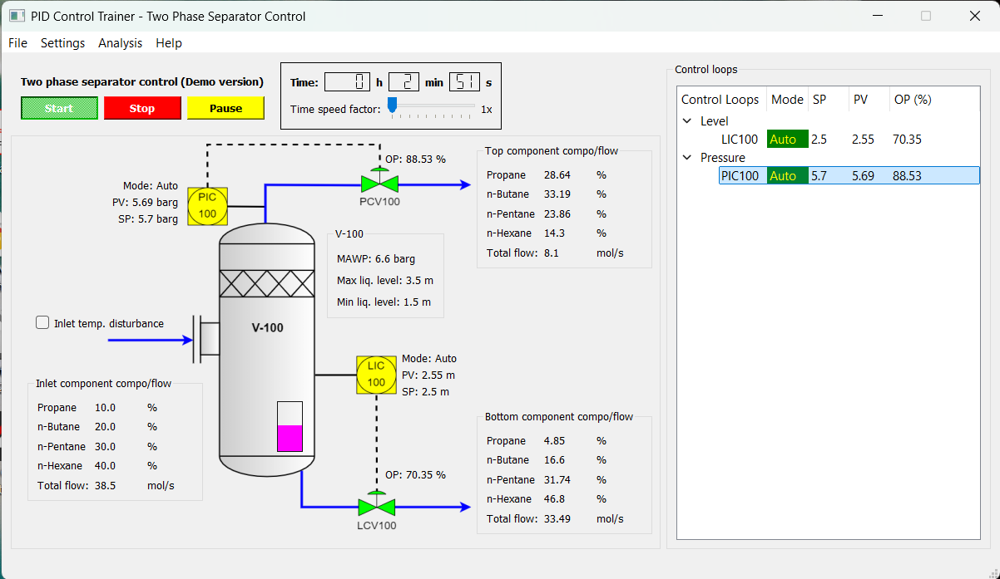
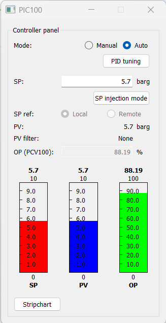
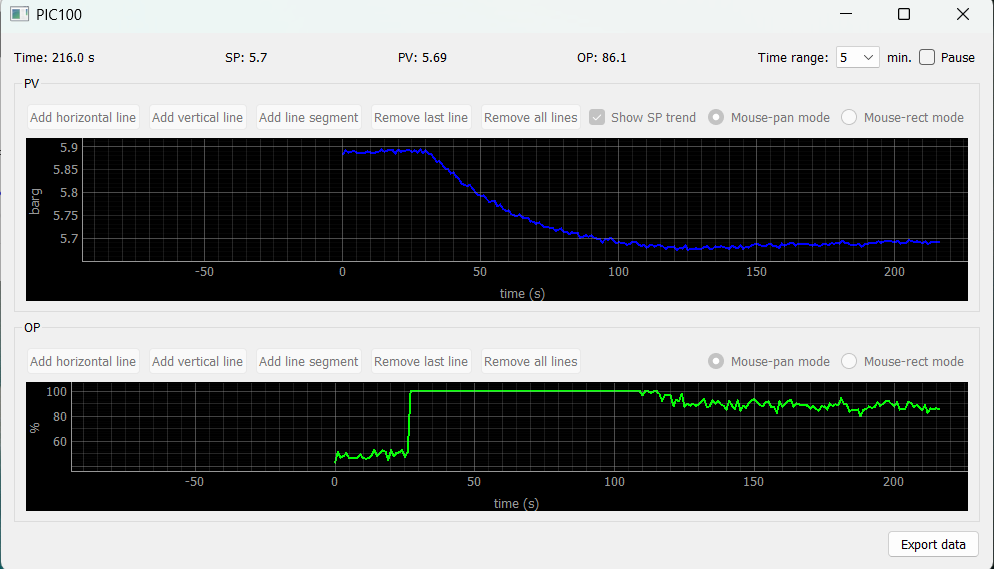
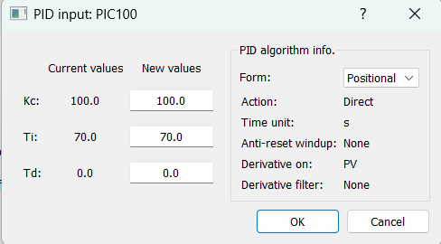

# A Simple PID Trainer App

An interactive app for training PID controller based on industrial chemical process

## Installation and Launch

1. **Clone the packages:**
   ```bash
   git clone https://github.com/nazrifuad2020/pid-control-trainer.git
   cd pid-control-trainer
   ```

2. **Install the packages from the root directory:**\
   **using uv:**
   ```bash
   uv sync
   ```
   **or using pip:**
   ```bash
   pip install .
   ```

3. **Launc the app**
   ```bash
   pid-control-trainer
   ```

## Screenshot







